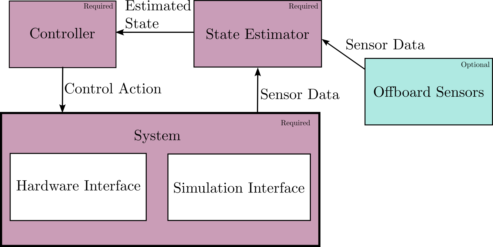

# Obelisk API
The Obelisk API defines a consistent set of interfaces to modularize the development of robotics stacks. At the core of Obelisk is ROS2, which provides a Publish-Subscribe (or Pub-Sub) interface for heterogenous nodes to interact with each other. Obelisk provides unified interfaces to simulators, hardware, state estimators, controllers, and other utilities like visualization and logging. Obelisk provides libraries written natively in both C++ and Python that allow you to easily interface with the Obelisk ecosystem. It should be noted that Obelisk is designed to make robotics control system development easier, but if a desired feature is not natively supported, Obelisk is easily extendible! It is possible to interface with non-Obelisk ROS2 systems from the Obelisk ecosystem, but this will be significantly more effort than staying in the Obelisk ecosystem. Obelisk is open source, so if you want a feature added, feel free to submit a pull request on [Github](https://github.com/Caltech-AMBER/obelisk).

Below we will cover all the concepts needed to work with Obelisk, including all relevant parts of the ROS2 ecosystem.

## Overview
In Obelisk we assume that there are three main blocks in every control system stack:
- Controller
- State estimator
- System (robot)

Beyond these main blocks, there are a number of optional blocks:
- Sensors
- Visualization (TBD)

The block diagram is as follows:

Further, we define basic *required* connections between these blocks as shown in the block diagram. For example, the state estimator always receives information from the System, and outputs an estimate to the Controller. When writing a robotics stack in Obelisk these connections are *always* present. These connections are a minimal requirement, and more can always be added. For example, the Controller may output multiple control actions rather than a single one.

There is a fundamental difference between the System block and every other block. The System block is what is being controlled, and thus is not normally implemented by the user. Obelisk provides implementations of the System block, while for every other block we provide a class interface that the user will need to implement.

The System block may either be the hardware interface or the simulation interface. For each simulator there is a single simulation interface that supports all robots, and currently there is only one supported simulator: [Mujoco](https://mujoco.org/). On the other hand, for each robot there is a specific hardware interface. Each robot that is in Obelisk ecosystem will need a custom hardware interface written for it, but once the is written anyone using Obelisk can easily interface with the robot.

## Obelisk Nodes
Each block in the above figure is comprised by one or more Obelisk nodes. Obelisk nodes are specialized ROS2 nodes, so we will begin by describing ROS2 nodes.

Nodes are processes that can interact with each other via a publish-subscribe system. This means that each node has the ability to both publish any number and type of messages and subscribe to any number and type of messages. Every message is published to a "topic" which is effectively a message stream, where the topic name is given by a string. Then any node that wants to listen to that data just needs to subscribe to that topic.

Each node must be "launched" when booting up your stack, and this is normally handled via a launch file. All Obelisk nodes are ROS2 Lifecycle nodes, which means that each node keeps track of its internal state. Lifecycle nodes can undergo the following state transitions:
- Configuration
- Activation
- Deactivation
- Cleanup
- Shutdown

During each of these, internal functions are automtically called to facilitate the transition. We provide "post-transition hooks" that you can implement to execute code during a transition. More information on generic ROS2 nodes can be found [here](https://docs.ros.org/en/humble/Concepts/Basic/About-Nodes.html).

An Obelisk node is a specific ROS2 node that has special features designed to make bringing up a robotics stack easy and hassle free. All of these are made up of the following parts:

Some of the main features are:
- Automatic handling (activation, deactivation, cleanup) of all Components
- Easily configurable via a yaml file
- Nominally only publish and subscribe to Obelisk messages
- Automatically launched - no need to write a custom launch file!
- [Lifecycle](https://github.com/ros2/demos/blob/humble/lifecycle/README.rst) states (as briefly mentioned above)

Obelisk nodes make it so you don't have to worry about all the details of the ROS interface, so that you can focus on writing the callbacks, which is the meat of most control stacks.

## Obelisk Messages and Topics
Obelisk comes with a set of custom message types that are designed to be used with Obelisk nodes. Having a standardized set of messages allows us to easily interface with other's code as it defines a basic input-output API, but also it allows us to encode useful meta-data in each message. Here we list all supported Obelisk message types (details on each message type is given in the code).
- Controller messages:
    - `PositionSetpoint`
- Estimator messages:
    - `EstimatedState`
- Sensor messages:
    - `JointEncoders`
    - `TrueSimState`

The topic names are configurable in the node configuration (yaml) file.

<!-- This abstract interface is achieved by defining a set of common [messages](https://docs.ros.org/en/humble/Concepts/Basic/About-Interfaces.html) and [topics](https://docs.ros.org/en/humble/Concepts/Basic/About-Topics.html). Standardizing these messages and topics within the lab will allow anyone to interface with a robot that is in the Obelisk ecosystem without hassle. Similarily, this will make is easy to test code on any simulator in the ecosystem. Each simulator and robot will need to be brought into the ecosystem through a Obelisk wrapper that will allow it to interface with the Obelisk API. Once a robot is in the ecosystem anyone can use it easily without needing to re-create the entire stack.

As part of accomplishing this, Obelisk defines a standardized "world" interface. The Obelisk wrappers let the simulators or robots expose the world interface that the rest of the robot stack can then interface with. Beyond the convinece of interfacing with other robots, this design choice should make moving from simulation to hardware seamless and increase the chances that a working simulation implies a working robot in the real world.

Beyond unifying the simulation and hardware interface, Obelisk users should be able to use other modules that are designed to fit into the Obelisk API easily. For example, if person A has written a state estimator for a robot, then person B should be able to write a controller that uses those state esimates easily and without modifying the source code for their controller or person A's state estimator. This will allow for more code sharing and collaboration.

Obelisk has been designed to provide these conviences with minimal overhead. -->

<!-- TODO (@zolkin): Add in a system diagram -->
<!-- TODO (@zolkin): Break this up into multiple files -->
<!-- ## Configuring Obelisk
Obelisk attempts to be flexible and abstract to meet everyone's needs. This means that for each specific use case we need to configure Obelisk to maximize our efficiency. This can be done through a few configuration files. The configuration files are read in at the start of run time and are not meant to be updated throughout a run.

Obelisk simulator interfaces accept a configuration file to make the simulation match the hardware as best as possible. The possible configuration paramters are given below.
- Robot model
- List of sensors
- Data rates for each sensor
- Configuration of anything hardware bound (e.g. on board PD controller gains)
- Additional noise for each sensor
- Any other objects in the environement (should also be able to be added programatically later.)

Obelisk hardware interfaces accept a configuration file too. The hardware accepts the below paramteres.
- Configuration of anything hardware bound (e.g. on board PD controller gains)

Details on each of these paramters and how to specify them are given at TBD. -->
<!-- TODO (@zolkin): Add in more information about this -->

<!-- ## Messages
Below is a list of messages used by Obelisk
- `obelisk_msg/State`
- `obelisk_msg/EstimatedState`
- `obelisk_msg/EstimatedPosition`
- `obelisk_msg/Joints`
- `obelisk_msg/EstimatedJoints`
- `sensor_msg/quat`
- `sensor_msg/Imu`
- `sensor_msg/Image` (is this the one we want?)
- `sensor_msg/PointCloud`
- `sensor_msg/JointState`
- `obelisk_msg/PDFeedForward`
- `obelisk_msg/Torques` -->

<!-- ## Topics
Below is the full list of topics used by Obelisk.

Topics relating to states and sensors:
- `/obelisk/Joints` (msg: `obelisk_msg/Joints`)
- `/obelisk/FullState` (msg: `obelisk_msg/State`)
- `/obelisk/IMU` (msg: `sensor_msg/Imu`)
- `/obelisk/Cameras` (msg: `sensor_msg/Image`)
- `/obelisk/Lidars` (msg: `sensor_msg/PointCloud`)
- `/obelisk/Encoders` (msg: `obelisk_msg/EstimatedJoints`)
- `/obelisk/Mocap` (msg: `obelisk_msg/EstimatedPosition`)
- `/obelisk/EstimatedState` (msg: `obelisk_msg/EstimatedState`)

Topics relating to controllers:
- `/obelisk/Torques` (msg: `obelisk_msg/Torques`)
- `/obelisk/PDFeedForward` (msg: `obelisk_msg/PDFeedForward`) -->
