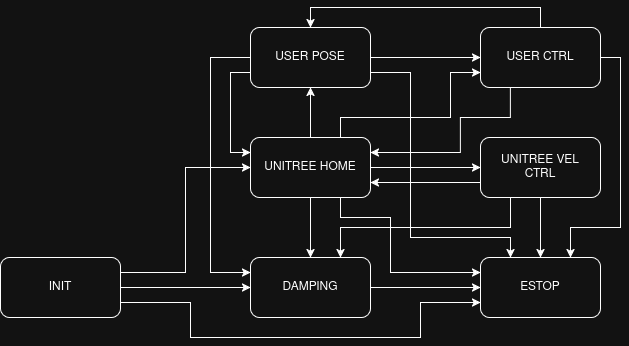

# Unitree Interfaces

`Obelisk` provides interfaces to communicate with various robotic hardware, as well as simulation environments aimed to mimic hardware as closely as possible. 
Currently supported systems include the Unitree Go2 quadruped and the Unitree G1 humanoid. 

## Finite State Machine

The Unitree Interfaces implement a finite state machine (FSM) to facilate easier, safer testing. A downstream project may often want to implement a FSM of their own, which controls the flow of the downstream control. This FSM should be handled downstream; we present a fundamental FSM implementing key testing pieces such as an ESTOP, Damping mode, interaction with the default Unitree locomotion controllers, a User Pose, and the user defined controller. The FSM is given by the following graph: 



## Controlling Robot Behavior via the Joystick

Currently, the FSM and velocity commands can be sent to the robot through the joystick. By default, the joystick implements the following button behaviors:

 - Right Trigger: ESTOP
 - Left Trigger: DAMPING
 - Left Stick: Velocity Commands (vertical -> x, horizonal -> y)
 - Right Stick: Yaw Rate Command
 - Left Button: Layer 1

To avoid having the default FSM conflict with any user-specified FSM operating on the same controller, the default FSM is implemented on a different 'Layer' - the layer button must be held down, then the following buttons will trigger (when valid) transitions of the default FSM:

 - DPad Left (L1): USER POSE
 - DPad Right (L1): UNITREE HOME
 - DPad Up (L1): UNITREE VEL CTRL
 - DPad Down (L1): USER CTRL

where L1 refers to Layer 1, i.e. the layer button must be held down. Additionally, all buttons not passed to the fsm are passed through on a separate joystick node (`/obelisk/g1/joy_passthrough` by default). It is recommended that the user subscribe to this topic to use the controller, rather than the joystick topic (default `/obelisk/g1/joy`), to avoid interference with the fsm. 

All of these buttons can be remapped as desired in the setup yaml. Here is a complete yaml, with all available options (omitted options will take default values): 

```
joystick:
    on: True
    pub_topic: /obelisk/g1/joy
    sub_topic: /obelisk/g1/joy_feedback
    ros_parameters:
        v_x_scale: 0.5
        v_y_scale: 0.5
        w_z_scale: 0.5
        unitree_home_button:    116  // DL1
        user_pose_button:       127  // DR1
        low_level_ctrl_button:  128  // DD1
        high_level_ctrl_button: 117  // DU1
        damping_button:          12  // LT
        estop:                   15  // RT     
        vel_cmd_x:               11  // LY
        vel_cmd_y:               10  // LX
        vel_cmd_yaw:             14  // RY
        layer:                    4  // LB
```
`scale` parameters refer to the multiplicative factor under which joystick inputs are scaled when passed to the unitree controller (or if the user controller is subscribed to the same message). 
Buttons are passed as integers, under the following map:
```
LT = 12     // 2 + AXIS_OFFSET,
RT = 15     // 5 + AXIS_OFFSET,
LB = 4,
RB = 5,
X = 3,
Y = 2,
A = 0,
B = 1,
DR = 27     // 6 + AXIS_OFFSET + NEG_OFFSET,
DL = 16     // 6 + AXIS_OFFSET,
DU = 17     // 7 + AXIS_OFFSET,
DD = 28     // 7 + AXIS_OFFSET + NEG_OFFSET,
LX = 10     // 0 + AXIS_OFFSET,
LY = 11     // 1 + AXIS_OFFSET,
RX = 13     // 3 + AXIS_OFFSET,
RY = 14,    // 4 + AXIS_OFFSET,
MENU = 7,

// Modified by layer button
X1 = 103    // X + LAYER_OFFSET,
Y1 = 102    // Y + LAYER_OFFSET,
A1 = 100    // A + LAYER_OFFSET,
B1 = 101    // B + LAYER_OFFSET,
DR1 = 127   // DL + LAYER_OFFSET,
DL1 = 116   // DR + LAYER_OFFSET,
DU1 = 117   // DU + LAYER_OFFSET,
DD1 = 128   // DD + LAYER_OFFSET,
```

Note that to avoid conflicts between `button` indices and `axis` indices (and issues with the DPad), we have added offsets `LAYER_OFFSET = 100`, to buttons on Layer 1, `AXIS_OFFSET = 10` to axes, and `NEG_OFFSET = 11` to elements of the DPad which report negative values when pressed. 


## Standard Pipeline for High Level Control
1. Ensure the relevant flag is `robot -> is simulated: False -> params: -> init_high_level: True`.
2. Turn the robot on.
3. Once robot signifies ready state (zero torque mode on G1 humanoid, standing up on Go2 quadruped), run fsm.
4. Start with INIT -> DAMPING, and follow up with DAMPING -> UNITREE_HOME (for the G1), or proceed directly with INIT -> UNITREE_HOME (for the Go2).
5. Proceed with UNITREE_HOME -> UNITREE_VEL for velocity control with the unitree default locomotion controllers.

## Standard Pipeline for Low Level Control
1. Either omit or ensure the relevant flag is `robot -> is simulated: False -> params: -> init_high_level: False`.
2. Turn the robot on.
3. Once robot signifies ready state (zero torque mode on G1 humanoid, standing up on Go2 quadruped), run fsm.
4. Start with INIT -> DAMPING, and follow up with DAMPING -> USER_POSE (for the G1), or proceed directly with INIT -> USER_POSE (for the Go2).
5. Proceed with USER_POSE -> USER_CTRL for user defined controllers.